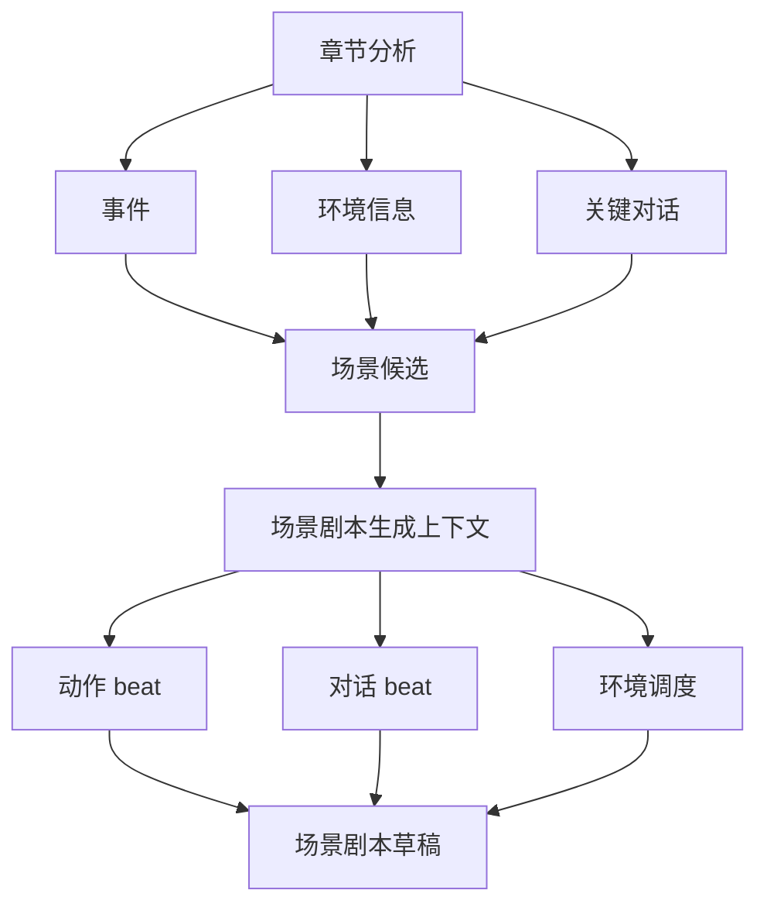

# 环境与对话驱动的剧本生成任务规划

本文档基于当前小说转剧本项目状态，重新规划后续任务。核心变化是：剧本生成不只依赖事件和场景候选，还要把“环境信息”和“事件关联对话”作为场景剧本生成的重要参考。

## 新增目标

- 抽取小说中的环境信息：天气、光线、声音、氛围、道具、空间视觉细节。
- 抽取小说中的关键对话，并明确对话关联到哪个事件。
- 在后续结构中，对话和环境还需要进一步关联到总场景与子场景。
- 在场景生成剧本时，将环境和对话作为参考元素。
- 支持围绕对话构建剧本：先保留关键原文对话，再改写成剧本台词和动作调度。
- 每条环境信息、关键对话仍需支持原文定位。

## 数据结构调整

后续数据结构将升级为层级模型，详见：

```text
docs/hierarchical-scene-extraction-plan.md
```

本文件中的 Event、Dialogue、EnvironmentInfo 是下层素材；新的上层容器会是：

- `NarrativeBlock`：章节级或多章节级总场景。
- `SubScene`：总场景下的细分可拍摄场景。

### EnvironmentInfo

用途：支持场景调度、视觉化改写、动作 beat 和氛围设计。

字段：

- `chapter_id`
- `scene_title`
- `event_titles`
- `location`
- `time_text`
- `weather`
- `light`
- `sound`
- `atmosphere`
- `props`
- `visual_details`
- `source_refs`

### Dialogue

新增用途：作为事件的相关信息，参与场景剧本生成。

新增字段：

- `event_title`
- `event_id`
- `dramatic_purpose`
- `source_refs`

### Event

新增关联字段：

- `dialogue_ids`
- `environment_ids`

这样每个事件可以知道：

- 它发生在怎样的环境中。
- 它有哪些关键对话。
- 它能为场景剧本生成提供哪些台词和调度素材。

## 新的剧本生成逻辑



## Prompt 任务分配

### 章节叙事分析 Prompt

负责一次性抽取：

- characters
- locations
- environments
- time_markers
- events
- relationships
- conflicts
- dialogues
- actions
- motivations
- causal_links
- scene_candidates
- emotion_arc

原因：

- 环境、对话、事件必须在同一章节上下文里判断。
- 对话需要挂到事件，单独抽取会丢失冲突语境。
- 环境通常服务于某个事件或场景，和 scene_candidates 一起抽取更稳。

### 场景剧本生成 Prompt

后续接 DeepSeek 时，每次只发送一个场景上下文：

- scene candidate
- related events
- related environments
- related dialogues
- related actions
- present characters
- source refs

输出：

- action beats
- dialogue beats
- adaptation note
- risks

## 当前已完成的代码调整

- 后端模型新增 `EnvironmentInfo`。
- `Dialogue` 新增 `event_title`、`event_id`、`dramatic_purpose`、`source_refs`。
- `Event` 新增 `dialogue_ids`、`environment_ids`。
- 章节分析聚合会收集 `environments`。
- 事件会根据 `event_title` 关联对话。
- 事件会根据 `event_titles` 关联环境。
- 前端类型和 API 映射已加入 environments。
- 剧本草稿生成会把相关环境和对话带入场景草稿。
- 剧本生成页会展示“环境参考”和“对话参考”。

## 后续任务拆分

### PR 1：重新分析数据闭环

目标：让新 prompt 产出的 environments 和 event dialogues 进入前端。

任务：

- 强制刷新旧 DeepSeek 缓存。
- 重新分析章节。
- 检查 `.debug/deepseek` 是否包含 environments。
- 检查事件是否有 dialogue_ids/environment_ids。
- 检查前端剧本生成页是否显示环境与对话参考。

验收：

- `AnalysisResult.environments` 非空。
- 至少部分 `Dialogue.event_title` 非空。
- 至少部分 `Event.dialogue_ids` 非空。
- 至少部分 `Event.environment_ids` 非空。

### PR 2：场景剧本生成上下文接口

目标：后端提供单场景生成上下文，前端不再自行拼装。

接口建议：

```text
GET /api/documents/{document_id}/screenplay/context/scenes/{scene_id}
```

返回：

- scene
- events
- environments
- dialogues
- actions
- characters
- source refs

### PR 3：AI 单场景补全接口

目标：替换当前前端规则版 AI 自动补全。

接口建议：

```text
POST /api/documents/{document_id}/screenplay/scenes/{scene_id}/complete
```

输入：

- 用户当前编辑文本
- 是否保留原文对话
- 是否强化视觉动作

输出：

- 剧本文本
- beats
- 使用的 dialogue_ids
- 使用的 environment_ids
- adaptation risks

### PR 4：剧本编辑器结构化

目标：从 textarea 升级为 beat 编辑器。

功能：

- action beat
- dialogue beat
- parenthetical beat
- transition beat
- 每个 beat 可查看来源事件、对话、环境。

### PR 5：总览与导出增强

目标：导出完整 YAML Schema，而不是当前简版 YAML。

补充：

- characters
- acts
- scenes
- beats
- continuity
- validation
- source refs

## 剧本生成策略更新

生成场景时优先级如下：

1. 用 environment 建立空间、光线、声音和氛围。
2. 用 event 明确冲突目标、阻力和结果变化。
3. 用 dialogue 作为场景核心台词素材。
4. 用 action 把心理活动转成可拍动作。
5. 用 motivation 和 relationship 约束人物说话方式。

如果某场景有关键对话，应围绕对话构建：

- 对话前：用环境和动作建立压力。
- 对话中：保留或改写关键句，强化角色目标冲突。
- 对话后：用动作或沉默展示局面变化。

## 注意事项

- 旧缓存没有 environments 和 dialogue source_refs，必须重新分析。
- 新缓存版本已改变，正常情况下会避开旧缓存。
- 模型输出对话时必须写 `event_title`，否则难以挂到事件。
- 环境信息不要泛泛而谈，要可拍摄、可调度。
- 不要把大段小说对话直接搬进剧本，应提炼成可演台词。
