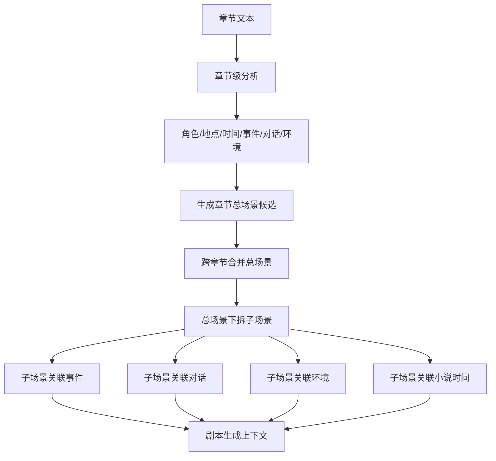

# 层级化场景提取与展示规划

本文档规划新的信息提取方式：不再把章节直接拆成平铺事件和场景，而是先建立“总场景”，再在总场景下细分子场景、事件、对话、环境、小说时间等信息。

## 为什么要调整

当前结构更接近“章节 -> 事件/场景候选”的平铺模型。它适合做信息看板，但对剧本生成还不够自然。

剧本创作更常见的工作方式是：

- 先判断这一章或几章整体讲了什么。
- 再判断它们构成一个什么大场面或大段落。
- 然后在这个大场面内部拆分具体场景、事件、对话和调度。

所以新的数据结构应改为：

```text
小说文档
  -> 总场景组
      -> 子场景
          -> 事件
          -> 对话
          -> 环境
          -> 小说时间
          -> 动作
          -> 冲突
```

## 核心概念

### 总场景 NarrativeBlock

总场景是剧本生成前的“叙事大单元”。

它可以来自：

- 单章：一章形成一个总场景。
- 多章：多章围绕同一地点、同一连续行动、同一冲突目标，合并为一个总场景。

适合合并为多章总场景的情况：

- 多章连续发生在同一地点。
- 多章围绕同一个行动目标。
- 多章是同一场冲突的铺垫、升级和结果。
- 多章中人物关系和情绪张力连续推进。

总场景用途：

- 作为剧本生成页左侧的一级列表。
- 作为 DeepSeek 单次生成或分批生成的上层上下文。
- 支持用户先确认“大段落结构”，再编辑子场景。

建议字段：

```json
{
  "id": "block-1",
  "title": "明道宫滞留",
  "chapter_ids": ["chapter-1", "chapter-2"],
  "summary": "赵玖在明道宫醒来并试探身边权力结构。",
  "dramatic_goal": "建立主角处境和核心阻力",
  "main_conflict": "赵玖想夺回主动权，近臣和局势阻碍他行动。",
  "story_time": "建炎元年秋",
  "location_scope": ["明道宫", "军营"],
  "character_ids": ["char-1", "char-2"],
  "sub_scene_ids": ["subscene-1", "subscene-2"],
  "source_refs": []
}
```

### 子场景 SubScene

子场景是总场景下的可拍摄单元，更接近剧本中的 scene。

来源：

- 当前 `scene_candidates`
- 事件聚合
- 地点/时间变化
- 冲突目标变化

建议字段：

```json
{
  "id": "subscene-1",
  "block_id": "block-1",
  "title": "后殿试探",
  "location": "明道宫后殿",
  "time_text": "傍晚",
  "time_of_day": "昏",
  "dramatic_function": "铺垫",
  "event_ids": ["event-1", "event-2"],
  "dialogue_ids": ["dialogue-1"],
  "environment_ids": ["environment-1"],
  "action_ids": ["action-1"],
  "conflict_ids": ["conflict-1"],
  "source_refs": []
}
```

### 事件 Event

事件仍是剧情推进的基础，但从属关系应更明确：

```text
NarrativeBlock -> SubScene -> Event
```

事件字段需要保留：

- `block_id`
- `sub_scene_id`
- `dialogue_ids`
- `environment_ids`
- `time_marker_ids`

这样事件不再是孤立卡片，而是总场景和子场景内部的组成部分。

### 对话 Dialogue

对话必须挂到事件，必要时也挂到子场景。

新增/强化字段：

- `block_id`
- `sub_scene_id`
- `event_id`
- `event_title`
- `dramatic_purpose`
- `turning_effect`

用途：

- 场景剧本生成时围绕关键对话展开。
- 前端展示“这个事件有哪些关键台词”。
- 后续生成 dialogue beat。

### 环境 EnvironmentInfo

环境信息也应挂到总场景或子场景。

强化字段：

- `block_id`
- `sub_scene_id`
- `event_ids`
- `location`
- `time_text`
- `weather`
- `light`
- `sound`
- `atmosphere`
- `props`
- `visual_details`

用途：

- 生成动作和场面调度。
- 建立每个子场景的视觉基调。
- 在前端作为“环境板”展示。

### 小说时间 NovelTime

当前 `TimeMarker` 偏向时间点。新结构需要把小说时间作为展示维度。

建议保留 `TimeMarker`，但在展示层组织成：

- 总场景时间：大范围时间。
- 子场景时间：具体时间表达。
- 事件时间：事件发生顺序。

## 新的数据提取流程



## Prompt 规划

### 第一阶段：章节内抽取

每章仍单独调用 DeepSeek，抽取基础信息：

- characters
- locations
- environments
- time_markers
- events
- dialogues
- actions
- conflicts
- motivations
- causal_links
- chapter_blocks

新增 `chapter_blocks`：

```json
{
  "chapter_blocks": [
    {
      "title": "明道宫醒来",
      "chapter_ids": ["chapter-1"],
      "summary": "主角醒来并感知局势。",
      "dramatic_goal": "建立处境",
      "main_conflict": "主角不清楚身份和权力边界",
      "location_scope": ["明道宫"],
      "event_titles": ["赵玖醒来", "康履试探"],
      "source_refs": []
    }
  ]
}
```

### 第二阶段：跨章节总场景合并

输入多章 `chapter_blocks`，由规则或模型合并：

- 相邻章节
- 同地点
- 同冲突目标
- 同一连续行动
- 情绪张力连续

输出：

- narrative_blocks
- block -> chapter_ids
- block -> event_titles

第一版可以用规则：

- 默认一章一个 block。
- 如果相邻两章地点相同且主要人物重合超过 50%，允许合并。
- 如果相邻两章 causal_links 连续，允许合并。

### 第三阶段：总场景下细分子场景

输入：

- narrative_block
- block 内事件
- block 内环境
- block 内对话
- block 内时间

输出：

- sub_scenes
- sub_scene -> event_ids
- sub_scene -> dialogue_ids
- sub_scene -> environment_ids
- sub_scene -> time_marker_ids

## 后端数据模型规划

建议新增：

```python
class NarrativeBlock(BaseModel):
    id: str = ""
    title: str = ""
    chapter_ids: list[str] = []
    summary: str = ""
    dramatic_goal: str = ""
    main_conflict: str = ""
    story_time: str = ""
    location_scope: list[str] = []
    character_ids: list[str] = []
    sub_scene_ids: list[str] = []
    source_refs: list[SourceRef] = []


class SubScene(BaseModel):
    id: str = ""
    block_id: str = ""
    title: str = ""
    location: str = ""
    time_text: str = ""
    time_of_day: str = ""
    dramatic_function: str = ""
    event_ids: list[str] = []
    dialogue_ids: list[str] = []
    environment_ids: list[str] = []
    action_ids: list[str] = []
    conflict_ids: list[str] = []
    source_refs: list[SourceRef] = []
```

建议保留当前 `Scene`，但逐步迁移为：

- `NarrativeBlock`：总场景
- `SubScene`：细分场景
- `Scene`：剧本成稿中的 scene

这样概念更清楚。

## 前端展示规划

### 1. 场景拆分板改为层级展示

左侧：

- 总场景列表
- 每个总场景显示：
  - 章节范围
  - 主要地点
  - 主要人物
  - 主冲突

右侧：

- 当前总场景下的子场景
- 子场景卡片内展示：
  - 事件
  - 对话
  - 环境
  - 小说时间

交互：

- 点击总场景：切换右侧子场景列表。
- 点击子场景：打开原文比对。
- 点击事件/对话/环境：定位原文。

### 2. 事件时间线改为“总场景时间线”

结构：

```text
总场景 1
  章节：chapter-1 ~ chapter-2
  小说时间：傍晚到夜间
  子场景 A
    事件 1
    对话 1
    环境 1
  子场景 B
    事件 2
```

### 3. 剧本生成页改为总场景优先

左侧：

- 总场景列表
- 展开后显示子场景

右侧：

- 选中子场景的剧本编辑器
- 显示该子场景的：
  - 环境参考
  - 对话参考
  - 事件参考
  - 小说时间

AI 自动补全：

- 输入应是一个子场景，而不是整章。
- 如果用户选择总场景，可以批量生成该总场景下所有子场景。

### 4. 剧本总览页

按总场景分组展示：

```text
总场景：明道宫滞留
  子场景：后殿试探
  子场景：军营夜谈
  子场景：朝臣对峙
```

导出 YAML 时：

- 总场景可导出为 act/sequence。
- 子场景导出为 screenplay.scenes。
- 子场景内事件、对话、环境导出为 source 和 beats 的参考信息。

## 任务拆分

### PR 1：新增层级数据模型

- 新增 `NarrativeBlock`
- 新增 `SubScene`
- Event/Dialogue/EnvironmentInfo 增加 block/sub_scene 关联字段
- AnalysisResult 增加 narrative_blocks/sub_scenes

### PR 2：更新章节分析 Prompt

- 输出 `chapter_blocks`
- 输出 sub_scene 候选
- 对话、环境、事件都必须能挂到 block/sub_scene

### PR 3：规则合并总场景

- 默认一章一个总场景
- 支持相邻章节合并
- 生成 `narrative_blocks`
- 生成 `sub_scenes`

### PR 4：前端层级展示

- 场景拆分板改为总场景 + 子场景
- 时间线改为总场景时间线
- 原文比对支持 block/sub_scene/event/dialogue/environment

### PR 5：剧本生成页调整

- 左侧总场景树
- 右侧子场景剧本编辑
- AI 自动补全按子场景生成
- 支持总场景批量生成

### PR 6：导出 Schema 升级

- YAML 中保留总场景结构
- 子场景映射为 screenplay.scenes
- beats 绑定 event/dialogue/environment source refs

## 推荐落地顺序

建议先不要立刻删掉现有 `scene_candidates`。

更稳妥的方式：

1. 保留当前平铺数据。
2. 新增 `narrative_blocks` 和 `sub_scenes`。
3. 前端优先展示新结构。
4. 如果新结构为空，则回退到旧 scenes/events。
5. 等新 prompt 稳定后，再逐步弱化旧 scene_candidates。

这样不会破坏当前已经可用的角色、事件、关系、场景和剧本编辑流程。

