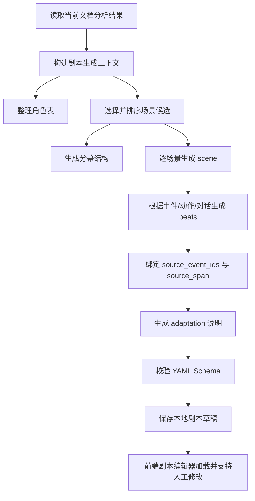

# 剧本生成实现构思

本文档说明如何基于当前已抽取的数据，实现从小说叙事分析结果到剧本 YAML 草稿的生成流程。设计依据来自 `schemas/screenplay.schema.yaml` 与 `docs/screenplay-schema-research.md`。

## 目标

剧本生成不是把小说原文直接改写成连续文本，而是生成一份可编辑、可追溯、可校验的结构化剧本草稿。

最终输出应包含：

- 剧本元信息：标题、来源文档、草稿版本、语言、格式。
- 剧本角色表：角色功能、欲望、需求、弧光、说话风格。
- 分幕结构：把场景按叙事功能分配到 setup、confrontation、resolution。
- 场景列表：每个场景包含场景标题、戏剧功能、来源事件、出场人物、剧本 beat。
- 剧本 beat：动作、对话、转场、提示、注释等最小可编辑单元。
- 原文追溯：每个场景和关键 beat 都能回到章节、事件和原文位置。
- 改编说明：记录合并、删减、新增、风险和理由。

## 当前已有数据

当前叙事分析已经提供以下数据：

| 数据 | 剧本生成用途 |
| --- | --- |
| Chapter | 剧本来源范围、章节顺序、章节预览定位 |
| Character | 剧本角色表、出场人物、角色声音、角色弧光 |
| Event | 场景来源、动作 beat、冲突推进 |
| Scene Candidate | 剧本 scene 的初始骨架 |
| Location | 场景标题中的地点 |
| TimeMarker | 场景标题中的时间段、连续性时间线 |
| Relationship | 角色冲突、同盟、压迫关系 |
| Conflict | 场景戏剧功能、阻力、 stakes |
| Dialogue | 对话 beat 的候选素材 |
| Action | 动作 beat 的候选素材 |
| Motivation | 角色 want、need、arc |
| CausalLink | 场景排序、因果连续性 |
| EmotionArc | 场景情绪起点、终点、张力 |
| SourceRef | 原文定位、人工校对、生成可信度判断 |

## 总体生成流程



## 阶段一：构建剧本上下文

后端先把当前分析结果整理为一个生成上下文，避免每次 prompt 都塞入全量无关数据。

建议上下文结构：

```json
{
  "document": {
    "document_id": "string",
    "filename": "string",
    "chapter_ids": ["chapter-1"]
  },
  "characters": [],
  "scene_candidates": [],
  "events_by_scene": {},
  "dialogues_by_event": {},
  "actions_by_event": {},
  "motivations_by_character": {},
  "relationships": [],
  "causal_links": []
}
```

处理原则：

- 只把与目标场景相关的事件、动作、对话送入单场景生成 prompt。
- 全局角色表、关系、动机作为辅助上下文。
- 保留所有 `source_refs`，不允许生成时丢失来源。

## 阶段二：生成剧本角色表

剧本角色表不等同于小说人物卡片，需要补充“戏剧功能”。

可从当前数据推导：

- `screenplay_role`：根据 importance、关系网络、冲突参与次数推断。
- `want`：优先来自 Motivation.goal。
- `need`：由动机、恐惧、人物弧光推断。
- `arc`：根据角色在多个章节中的行动变化生成。
- `voice_note`：根据 Dialogue、role、description 生成。
- `source_character_ids`：绑定原角色 ID，支持别名合并。

实现方式：

1. 先用规则生成基础角色表。
2. 再用 DeepSeek 对主要角色补全 `want/need/arc/voice_note`。
3. 次要角色可只保留简短功能描述，减少成本。

## 阶段三：选择与排序场景

优先使用 `SceneCandidate` 作为剧本 scene 骨架。

排序规则：

1. 按 chapter 顺序排序。
2. 同章节内按 event_ids 的首次出现顺序排序。
3. 如存在 CausalLink，使用因果链校正顺序。
4. 若场景缺少事件，则放在同章节末尾，标记为 `adaptation.risks`。

场景合并规则：

- 同地点、同时间、同一冲突目标的事件可以合并为一个 scene。
- 只有背景说明、没有角色行动变化的事件可以压缩为 action beat。
- 重复解释性内容可进入 `adaptation.compression=summarized`。

## 阶段四：分幕结构

早期原型可以使用规则分幕，不必一开始复杂建模。

推荐策略：

- 前 25% 场景：`act-1`，功能为 setup。
- 中间 50% 场景：`act-2`，功能为 confrontation。
- 后 25% 场景：`act-3`，功能为 resolution。

后续增强：

- 根据 dramatic_function 判断关键节点。
- 根据 conflict 强度寻找转折点。
- 根据 EmotionArc 寻找高潮场景。
- 根据 CausalLink 建立 sequence。

## 阶段五：逐场景生成 scene

每个 scene 对应 Schema 中的：

```yaml
scene_heading:
dramatic:
source:
cast:
beats:
adaptation:
```

### scene_heading

来源：

- `location` 来自 SceneCandidate.location 或 Event.location。
- `time_of_day` 来自 SceneCandidate.time_of_day 或 TimeMarker。
- `prefix` 可暂时默认 `INT`，如果地点包含户外、街道、战场、城门等关键词则用 `EXT`。
- `raw` 组合为中文格式或行业格式。

示例：

```yaml
scene_heading:
  prefix: INT
  location: 明道宫后殿
  time_of_day: DAY
  raw: INT. 明道宫后殿 - DAY
```

### dramatic

来源：

- `purpose` 来自 SceneCandidate.dramatic_function。
- `conflict` 来自 Event.conflict 或 Conflict。
- `turning_point` 来自 Event.consequence 或 CausalLink。
- `stakes` 来自 Motivation、Conflict、Relationship。
- `emotional_value_start/end` 来自 EmotionArc。

### source

必须保留：

- `chapter_ids`
- `event_ids`
- `source_spans`

其中 `source_spans` 优先合并 scene.sourceRefs、event.sourceRefs。

## 阶段六：生成 beats

beat 是剧本编辑器的最小单位。

建议生成顺序：

1. `action`：建立环境、人物动作和可拍画面。
2. `dialogue`：使用已有 Dialogue 作为素材，必要时改写成剧本台词。
3. `parenthetical`：只在情绪或动作必要时添加。
4. `action`：展示冲突升级或转折。
5. `transition`：必要时添加转场。

beat 来源映射：

| 当前数据 | beat 类型 |
| --- | --- |
| Action | action |
| Dialogue | dialogue |
| Event.summary | action 或 note |
| Event.conflict | action 或 note |
| Event.consequence | action |
| SceneCandidate.adaptation_note | note |

生成约束：

- 每个 beat 必须尽量绑定 `source_event_ids`。
- 由模型新增的内容必须设置 `adaptation.added_for_screen=true` 或在 beat.revision_note 中说明。
- 对话不能长篇照搬小说叙述，应转为角色可说出口的短句。
- 动作 beat 只写可拍摄内容，避免心理描写堆叠。

## 阶段七：DeepSeek 生成策略

建议拆为三类 prompt，避免一次生成整本剧本导致不可控。

### 1. 角色剧本化 prompt

输入：

- 主要角色卡片
- 动机
- 关系
- 对话样本

输出：

- screenplay characters

用途：

- 补全 want、need、arc、voice_note。

### 2. 场景大纲 prompt

输入：

- scene_candidates
- events
- conflicts
- causal_links

输出：

- acts
- scene list
- scene dramatic
- source mapping

用途：

- 确定剧本结构。

### 3. 单场景 beat prompt

输入：

- 单个 scene candidate
- 关联 events/actions/dialogues
- 出场人物与 voice_note
- source_refs

输出：

- beats
- adaptation

用途：

- 逐场景生成剧本文本，方便并发和缓存。

## 阶段八：缓存与本地存储

剧本生成应延续当前 DeepSeek 调试策略。

建议目录：

```text
apps/api/app/.data/screenplays/
apps/api/app/.cache/screenplay/
apps/api/app/.debug/screenplay/
```

建议文件：

```text
.data/screenplays/{screenplay_id}.yaml
.data/screenplays/{screenplay_id}.json
.debug/screenplay/{document_id}/characters_prompt.md
.debug/screenplay/{document_id}/outline_prompt.md
.debug/screenplay/{document_id}/scene-{scene_id}/prompt.md
.debug/screenplay/{document_id}/scene-{scene_id}/response.json
```

缓存 key 应包含：

- schema version
- document id
- scene id
- source event ids
- prompt version
- model name

## 阶段九：前端实现

剧本生成页应从“静态 textarea”升级为结构化编辑器。

第一版功能：

- 点击“生成剧本草稿”。
- 左侧原文，可根据当前 scene/beat 自动定位。
- 中间场景列表。
- 右侧剧本 beat 编辑器。
- 支持编辑 action/dialogue/transition 文本。
- 支持查看 scene 的 source refs。
- 支持导出 YAML。

推荐前端状态结构：

```ts
type ScreenplayDraft = {
  id: string;
  title: string;
  source: {
    documentId: string;
    filename: string;
    chapterIds: string[];
  };
  characters: ScreenplayCharacter[];
  acts: Act[];
  scenes: ScreenplayScene[];
};
```

## 第一版落地计划

### PR 1：定义后端剧本模型

- 新增 Pydantic 模型，对齐 YAML Schema。
- 新增 screenplay repository。
- 新增本地保存与读取接口。

### PR 2：规则生成剧本骨架

- 不调用 DeepSeek。
- 用现有 scene_candidates/events 生成 scenes。
- 用 characters/motivations 生成角色表。
- 生成 acts 和 source mapping。

### PR 3：单场景 DeepSeek beat 生成

- 为每个 scene 调用一次模型。
- 写入 debug 文件。
- 支持缓存与重试。
- 输出 beats 和 adaptation。

### PR 4：前端剧本生成页

- 调用生成接口。
- 展示 scene 列表和 beat 编辑器。
- 点击 scene/beat 定位左侧原文。

### PR 5：导出 YAML 与人工修改保存

- 支持保存人工编辑。
- 支持导出 YAML。
- 支持重新生成单个场景。

## 风险与处理

| 风险 | 处理 |
| --- | --- |
| 模型编造剧情 | 每个 scene/beat 绑定 source refs，新增内容写入 adaptation |
| 对话不像角色 | 使用 voice_note 和历史 Dialogue 样本约束 |
| 场景过长 | 限制单场景 beat 数量，超长场景拆分 |
| 缺少 source_refs | 用 evidence 二次定位，仍失败则标记风险 |
| YAML 不合法 | 先生成 JSON，校验后再转换 YAML |
| 成本过高 | 角色表和场景大纲只生成一次，beats 按场景缓存 |

## 推荐第一步

先实现“规则版剧本骨架生成”，不要直接做完整 LLM 剧本。

原因：

- 当前已有数据已经足够生成 scene、source、cast、dramatic 的初稿。
- 规则版能先验证 Schema、前端编辑器和原文追溯是否成立。
- 后续 DeepSeek 只负责最难的 beat 文本改写，风险更可控。

